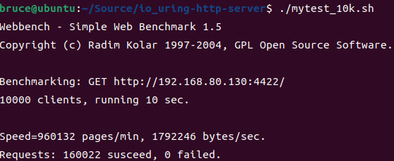

基于io_uring的HTTP服务器
===============

Linux下C++轻量级Web服务器。

* 使用**线程池 + io_uring + Proactor模式**的并发模型
* 使用**状态机**解析HTTP请求报文，支持解析**GET和POST**请求
* 通过访问服务器数据库实现web端用户**注册、登录**功能，可以请求服务器**图片和视频文件**
* 实现**同步/异步日志系统**，记录服务器运行状态
* 经Webbench压力测试可以实现**上万的并发连接**数据交换

基础测试
------------

* 服务器测试环境
  * Ubuntu版本22.10
  * MySQL版本8.0.32

* 浏览器测试环境
  * Windows、Linux均可
  * Chrome

* 测试前确认已安装MySQL数据库

    ```C++
    // 建立yourdb库
    create database yourdb;

    // 创建user表
    USE yourdb;
    CREATE TABLE user(
        username char(50) NULL,
        passwd char(50) NULL
    )ENGINE=InnoDB;

    // 添加数据
    INSERT INTO user(username, passwd) VALUES('name', 'passwd');
    ```

* 修改main.c中的数据库初始化信息

    ```C++
    // root root修改为服务器数据库的登录名和密码

    // serverdb修改为上述创建的yourdb库名
    connPool->init("localhost", "root", "password", "serverdb", 3306, 8);
    ```

* 修改http_conn.cpp中的root路径

    ```C++

    // 修改为root文件夹所在路径
    const char* doc_root="/home/bruce/Source/io_uring-http-server/root";
    ```

* 生成server

    ```C++
    make server
    ```

* 启动server

    ```C++
    ./server port
    ```

* 浏览器端

    ```C++
    ip:port
    ```

个性化测试
------

> * 日志写入方式，代码中使用同步日志，可以修改为异步写入.

* [x] 同步写入日志
  * 关闭main.c中ASYNLOG，打开同步写入SYNLOG

     ```C++
     25 #define SYNLOG //同步写日志
     26 //#define ASYNLOG   /异步写日志
     ```

* [ ] 异步写入日志
  * 关闭main.c中SYNLOG，打开异步写入ASYNLOG

     ```C++
     25 //#define SYNLOG //同步写日志
     26 #define ASYNLOG   /异步写日志
     ```

* 关闭日志，按照前述生成server，启动server，每分钟响应请求数：960132 pages/min


相关链接
------------

[牛客网系列教学视频：Linux高并发服务器开发](https://www.nowcoder.com/study/live/504)

[WebServer服务器项目可能会被问到的问题(一)](https://www.nowcoder.com/discuss/934904)

[WebServer服务器项目可能会被问到的问题(二)](https://www.nowcoder.com/discuss/939267)

[WebServer服务器项目可能会被问到的问题(三)](https://www.nowcoder.com/discuss/353159645424459776)

[烂大街的WebServer分享一下](https://www.nowcoder.com/discuss/419276598265827328)

[CSDN的Linux高并发Web服务器项目实战总结](https://blog.csdn.net/qq_19887221/article/details/125500256)

[字节跳动分布式存储日常实习二面面经(含webserver项目)](https://www.nowcoder.com/discuss/379256223839920128)

[实习总结及C++后端开发学习路线总结](https://www.nowcoder.com/discuss/353157797267316736)
